## 基于Stm32的太阳能电池板自动追光系统设计

## 1-设计意义

​        目前存在的太阳能光伏板都是固定放置，即选择一定角度之后就固定不动，这次发电方式虽然结构简单，但是存在很多问题，光伏板接受到的光强大小为太阳光强在在光伏板竖直平面的投影，如图1-1所示，光伏板与平面的夹角为α，与太阳光之间的夹角为θ，若太阳光的光强功率为P1，那么光伏板接收到的光强P=sinθ*P1,根据三角函数的性质可以知道，sinθ永远小于等于1，在实际中，只有θ为Π/2时sinθ为1，因此P永远小于等于P1，只有当光伏板和太阳光之间的角度为Π/2时P=P1，此时发电功率最大。本次设计主要是设计一个以STM32为核心的智能追光发电系统，通过此系统光伏板与太阳光的夹角为几乎始终为Π/2，因此可以尽可能的接收光照，从而提高发电效率。

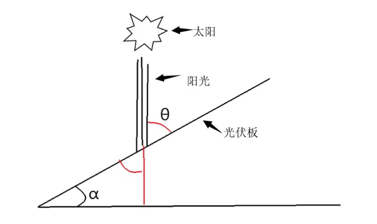

### 2-开发环境、开发工具介绍

**硬件平台：**

1. STM32F103C8T6控制核心
2. TDA 2822芯片
3. USR-GPRS232-7S3模块
4. L298N驱动

**软件平台：**

1. KEIL MDK

2. STM32CubeMx软件

3. STM32CubeMx软件

   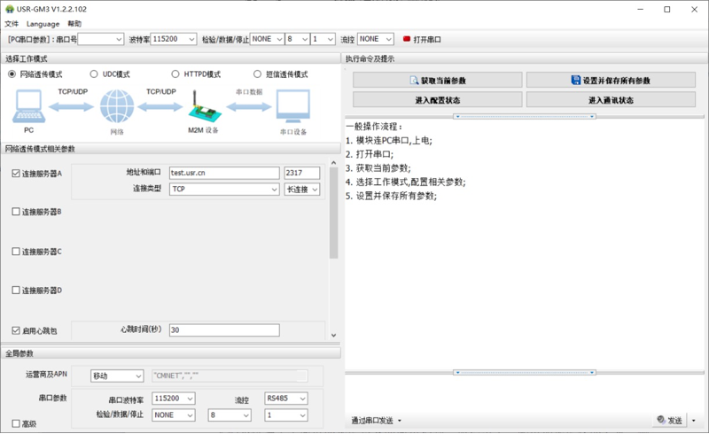

### 3-系统方案选择和整体设计

**整体思路：**

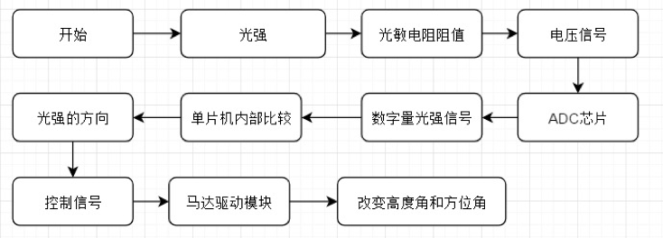

**基于遮光法设计寻光检测头：**

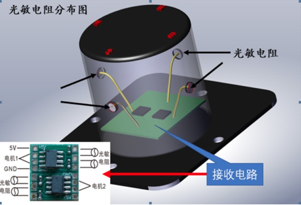

### 4-系统设计

**STM32103C8T6外接引脚原理图**

> 控制核心

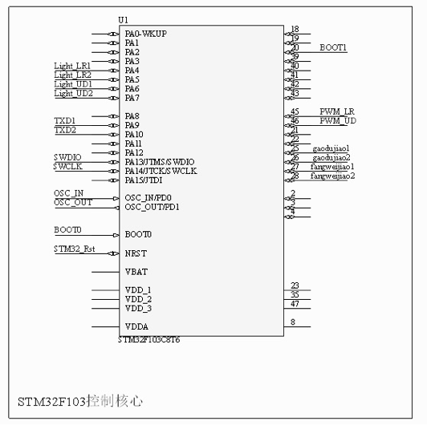

**USR-GPRS232-7S3短信透传模式：**

> 实现远程控制

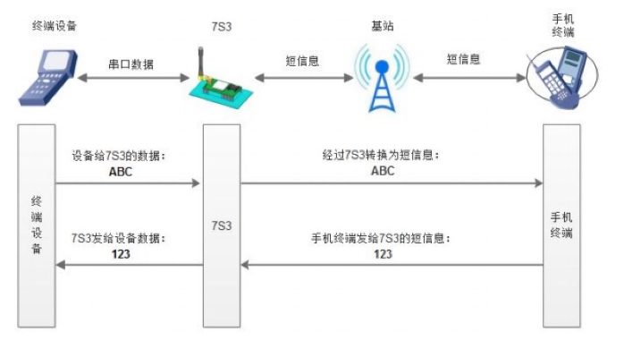

**USR-GPRS232-7S3原理图：**

> GPRS模块原理图

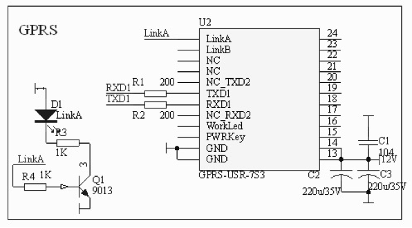

**L298N模块电驱动电路原理图：**

> 用来驱动马达，双通道

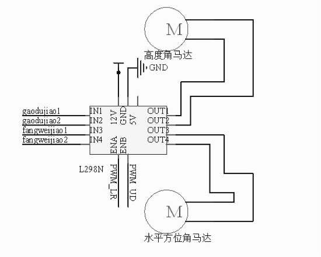

**寻光检测头工作流程：**

> 寻光检测头设计思路

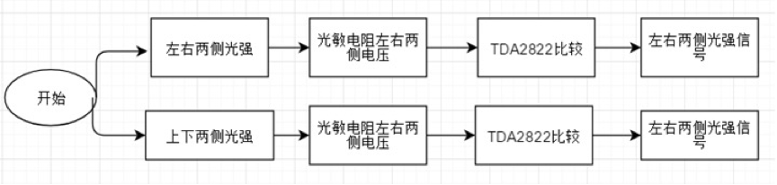

**寻光检测头原理图：**

> 原理图

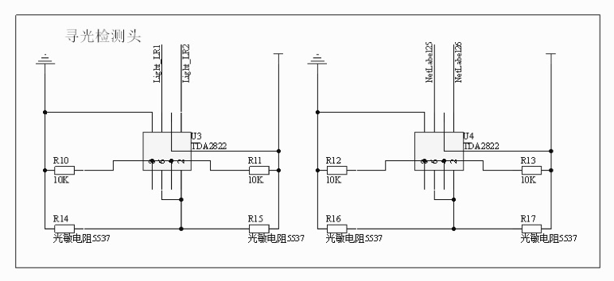

### **5-成果展示**

> 时间：2018-09-24 15:00

**打开追踪系统：**

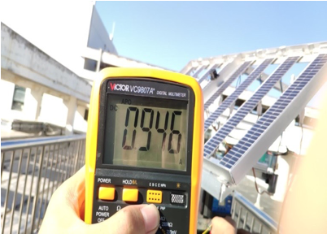

**关闭追踪系统：**

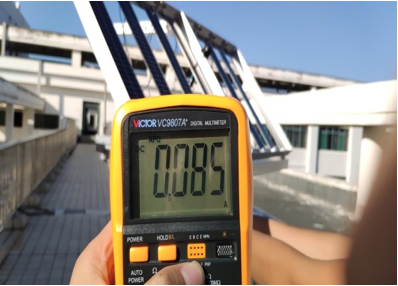

